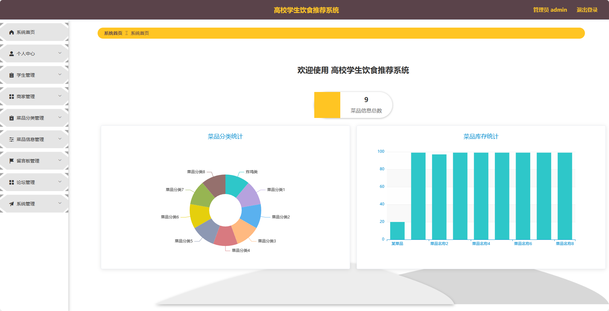
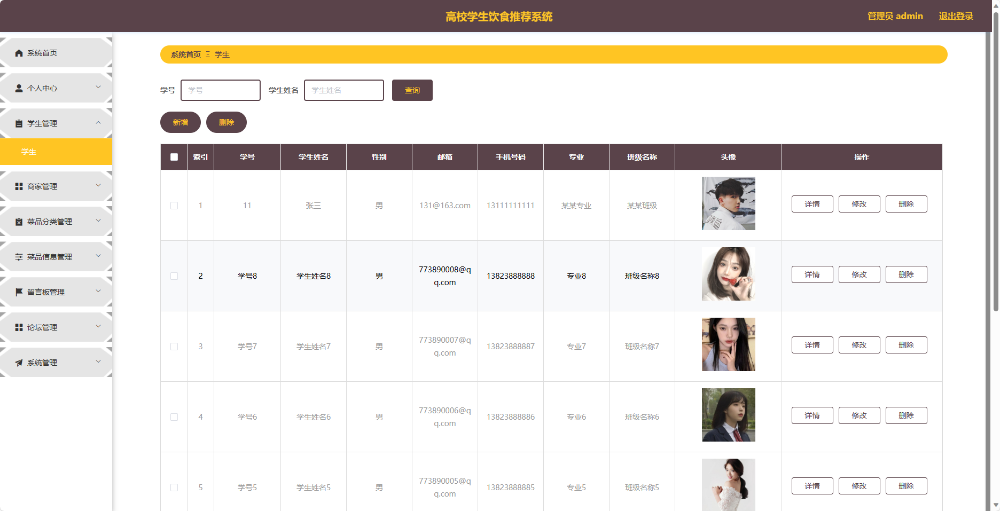
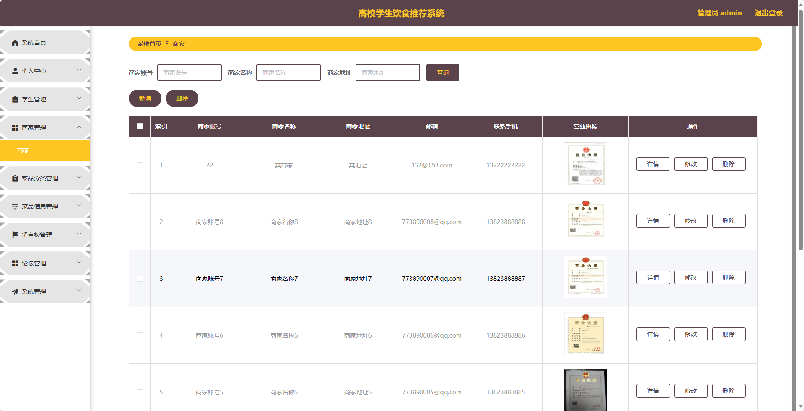
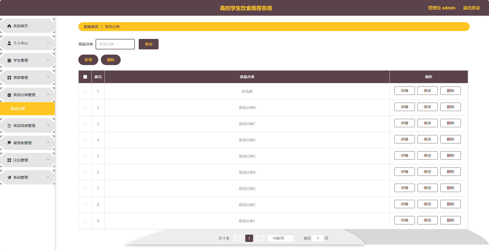
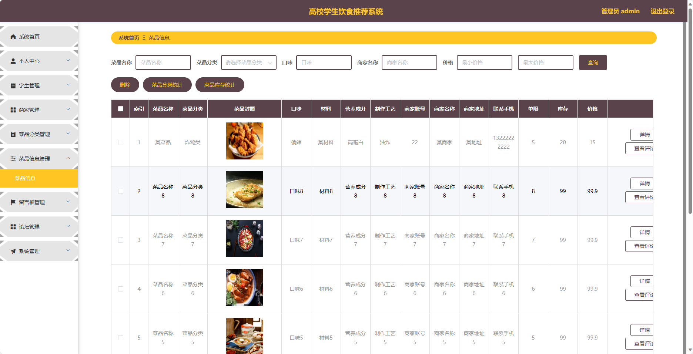
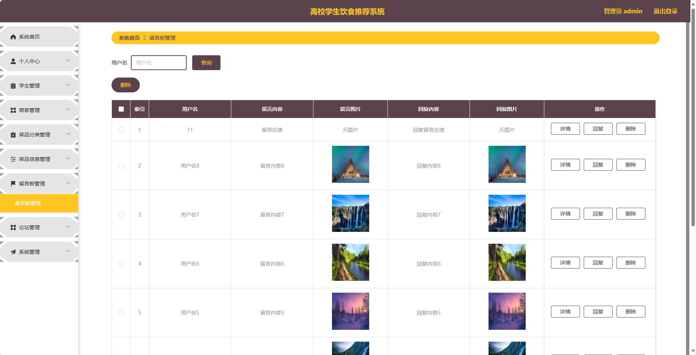
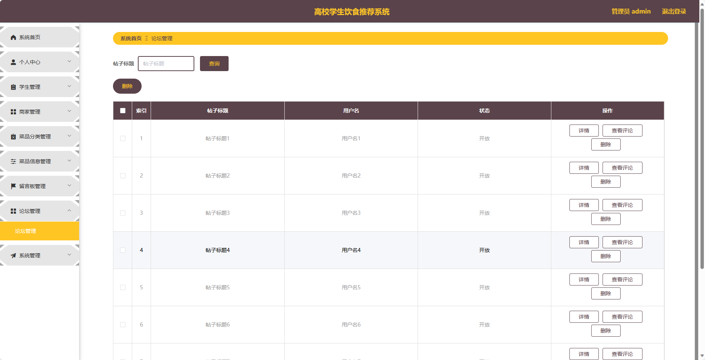

基于Springboot的高校学生饮食推荐系统（程序+论文）
=
### 完整代码获取地址：从戎源码网 ([https://armycodes.com/](https://armycodes.com/))
### 作者微信：19941326836  QQ：952045282 
### 承接计算机毕业设计、Java毕业设计、Python毕业设计、深度学习、机器学习
### 选题+开题报告+任务书+程序定制+安装调试+论文+答辩ppt 一条龙服务
### 所有选题地址https://github.com/nature924/allProject

一、项目介绍
---
基于Spring Boot框架实现的高校学生饮食推荐系统，系统包含两种角色：管理员、学生、商家,系统分为前台和后台两大模块，主要功能如下
### 前台模块：
- 首页：展示系统的概览信息、推荐菜品等内容。
- 菜品信息：用户可以查看、搜索、筛选菜品信息。
- 论坛：用户可以在论坛中进行交流、分享经验等。
- 健康资讯：提供各种健康饮食相关的资讯。
- 留言板：用户可以在留言板上留下自己的建议和意见。
- 购物车：用户可以将心仪的菜品加入购物车。
- 个人中心：用户管理个人信息，包括修改密码、查看订单等操作。

### 后台模块（管理员）：
- 个人中心：管理管理员的个人信息，包括修改密码等操作。
- 学生管理：管理学生的个人信息，包括查看学生列表、禁用学生等操作。
- 商家管理：管理商家的个人信息，包括查看商家列表、禁用商家等操作。
- 菜品分类管理：管理系统中菜品的分类信息。
- 菜品信息管理：发布和管理菜品信息，包括添加菜品、编辑菜品、删除菜品等操作。
- 留言板管理：管理留言板中用户的留言信息，包括查看留言列表、回复留言等操作。
- 论坛管理：管理论坛中用户的发帖和回帖情况，包括查看帖子列表、回复帖子等操作。
- 系统管理：管理系统的基础数据，如学院信息、专业信息等。
 
### 后台模块（商家）：
- 个人中心：管理商家的个人信息，包括修改密码等操作。
- 菜品信息管理：发布和管理商家的菜品信息，包括添加菜品、编辑菜品、删除菜品等操作。
- 订单管理：管理商家的订单信息，包括查看订单列表、确认订单等操作。

二、项目技术
---
- 编程语言：Java
- 数据库：MySQL
- 项目管理工具：Maven
- 前端技术：VUE、HTML、Jquery、Bootstrap
- 后端技术：Spring、SpringMVC、MyBatis

三、运行环境
---
- 操作系统：Windows、macOS都可以
- JDK版本：JDK1.8以上都可以
- 开发工具：IDEA、Ecplise、Myecplise都可以
- 数据库: MySQL5.7以上都可以
- Tomcat：任意版本都可以
- Maven：任意版本都可以

四、运行截图
---
### 程序截图：

